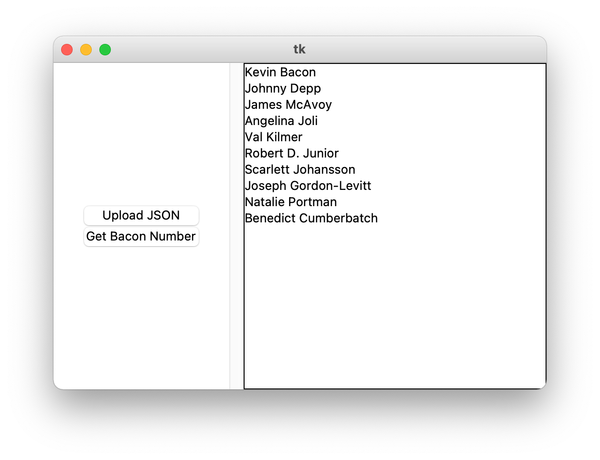

# About
## Input data 
The input data is located in the file: [data.json](./data.json) in the following form:
```json
[
{"name": "Kevin Bacon", films: [{"title": "Tremors", "year": 1989},.....]},
{актер 2},
{актер 3},
.....
]
```
## main
The Gui script:
```python
f = Frame()
f.pack(side=tkinter.LEFT, padx=30)

Button(f, text="Upload JSON", command=load_data).pack(fill=tkinter.X)
Button(f, text="Get Bacon Number", command=find_bacon_number).pack(fill=tkinter.X)

list_box = Listbox(width=35, height=20)
list_box.pack(side=tkinter.RIGHT)
scroll = Scrollbar(command=list_box.yview())
scroll.pack(side=tkinter.RIGHT, fill=tkinter.Y)
list_box.config(yscrollcommand=scroll.set)
```

# How to use
Run the command 
```bash
python3 main_gui.py
```


# baconNumberGUI
